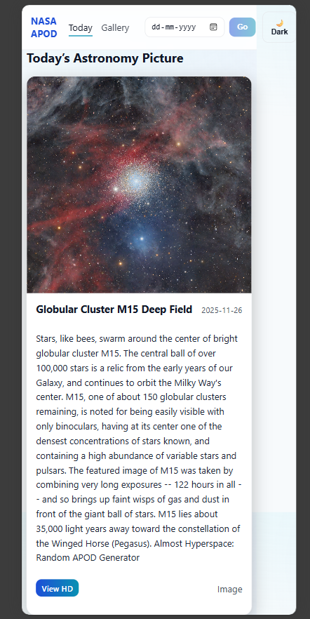
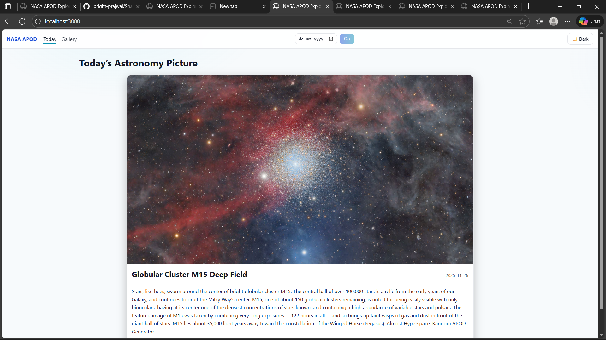
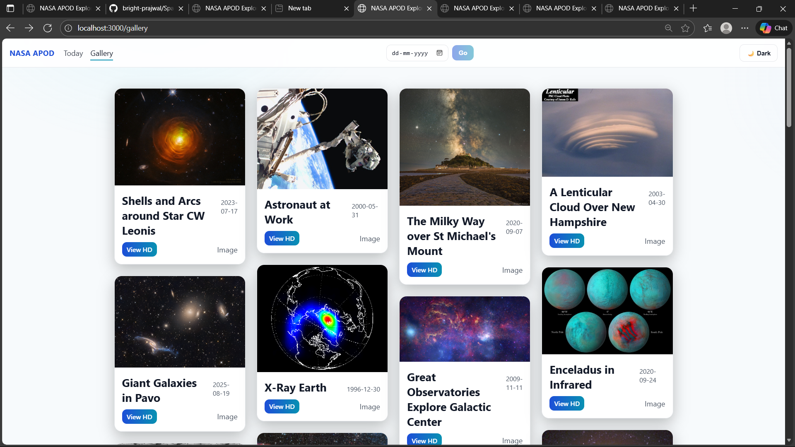
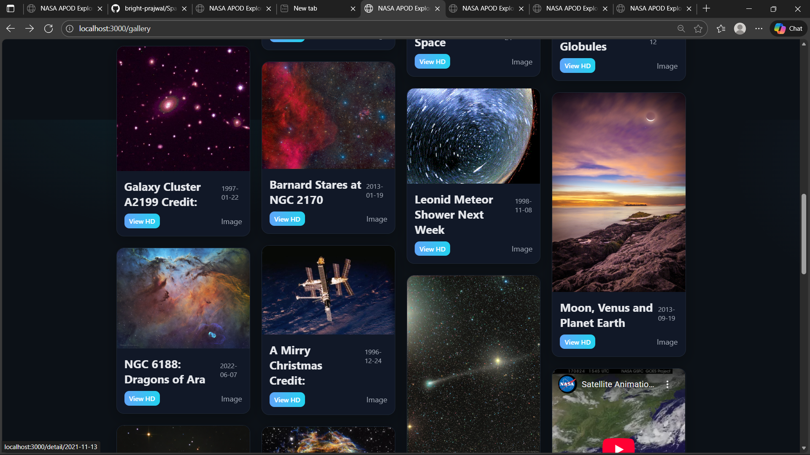

#  **NASA APOD Explorer**

A simple web application that displays NASA’s Astronomy Picture of the Day (APOD).
Includes **Today’s APOD**, **Gallery**, **Detail view**, caching backend, and responsive UI.

---

##  **Features**

###  Frontend (React)

* View **Today's APOD**
* **Gallery** with infinite scroll (Pinterest-style layout)
* **Detail view** for any date
* Fully **responsive design**
* Image + video support (YouTube, Vimeo)
* Modern UI with clean layout

### 🔹 Backend (Node.js + Express)

* API proxy for NASA APOD
* Response caching (LRU)
* Secure API key handling (ENV)
* REST API endpoints:

  * `/api/apod/today`
  * `/api/apod/:date`
  * `/api/apod/recent?count=10`
  * `/api/apod/range?start_date&end_date`

---

##  *Setup *

### ** Install Dependencies**

Frontend:

cd frontend
npm install

Backend:

cd backend
npm install

##  **Environment Variables**

### Backend `.env`

NASA_API_KEY=YOUR_API_KEY_HERE
PORT=5000

##  **Run the Project**

### Start Backend:

cd backend
npm start
Rns on: `http://localhost:5000`

### Start Frontend:
cd frontend
npm start
Runs on: `http://localhost:3000`

##  **How It Works**
1. React frontend requests APOD data from your backend.
2. Backend calls NASA API with your API key.
3. Backend caches results to avoid extra NASA calls.
4. Frontend displays images using a clean, responsive layout.

##  API Examples

### Get today's APOD: 
GET /api/apod/today

### Get image by date:
GET /api/apod/2024-01-01

### Get recent images:
GET /api/apod/recent?count=12

### Get range:
GET /api/apod/range?start_date=2024-01-01&end_date=2024-01-10

##  **Screenshots**

---

## **Done!**

This project is now fully functional with:

✔ Responsive frontend
✔ Stable backend
✔ Clean layout
✔ NASA APOD integration

